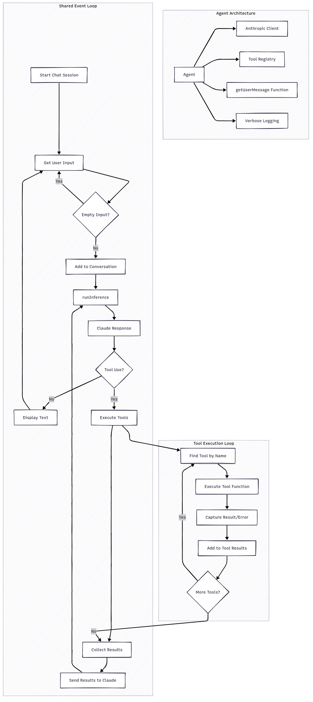

# Perry

Terminal-native coding agent with tools, planning, MCP, skills, permissions, and subagents.

## Install

Perry is published as a scoped npm package so it does not conflict with the unrelated `perry` npm package, while still installing a `perry` binary.

```bash
npm install -g @perry-ai/cli
perry
```

One-off runs:

```bash
npx @perry-ai/cli
pnpm dlx @perry-ai/cli
yarn dlx @perry-ai/cli
bunx @perry-ai/cli
```

Curl installer:

```bash
curl -fsSL https://perry.dev/install.sh | sh
```

Because the package exposes exactly one binary, `npm exec @perry-ai/cli`, `npx @perry-ai/cli`, and the global install all launch the same `perry` command.

## Runtime layout

- Installed Perry code and `SELF_MANIFEST.md` are loaded from the package installation.
- The target project is always the directory where you run `perry`.
- Project context is loaded from `AGENTS.md` / `CLAUDE.md` in the current directory tree.
- Project MCP and skills are loaded from `.mcp.json`, `.perry/mcp.json`, and `.perry/skills` in the current repo.
- Installed Perry user state defaults to `~/.perry-ai`.
- Source/dev Perry user state defaults to `~/.perry-dev`.
- Set `PERRY_HOME=/some/dir` to explicitly choose or share auth, sessions, preferences, global MCP, and global skills.

## Development

```bash
bun install
bun run dev
bun x tsc --noEmit
bun test
bun run build
npm pack --dry-run
```

Source/dev Perry already defaults to `~/.perry-dev`, separate from installed Perry's `~/.perry-ai`. You can still override it explicitly:

```bash
PERRY_HOME=~/.perry-dev-custom bun run dev
```

## Releases

CI runs on pushes and pull requests to `main`.

Perry publishes through npm Trusted Publishing, so the GitHub Actions release workflow does not need an `NPM_TOKEN` secret. Configure the trusted publisher for `@perry-ai/cli` in npm with:

- Owner: `raunak42`
- Repository: `perry`
- Workflow filename: `release.yml`
- Environment: leave blank

To publish a new npm release:

```bash
npm version patch
# or: npm version minor / npm version major
git push --follow-tags
```

Pushing a `v*.*.*` tag runs the release workflow, validates the package, and publishes to npm. The release workflow can also be started manually from GitHub Actions. Normal pushes to `main` run CI only; they do not publish.

## Architecture Inspiration

Inspired by [Geoffrey Huntley's agent architecture notes](https://ghuntley.com/agent/).


