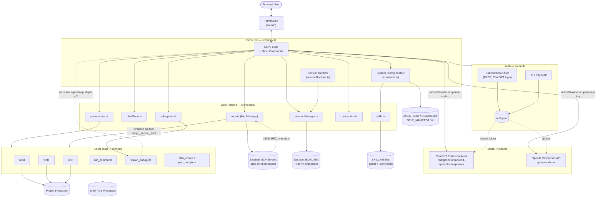
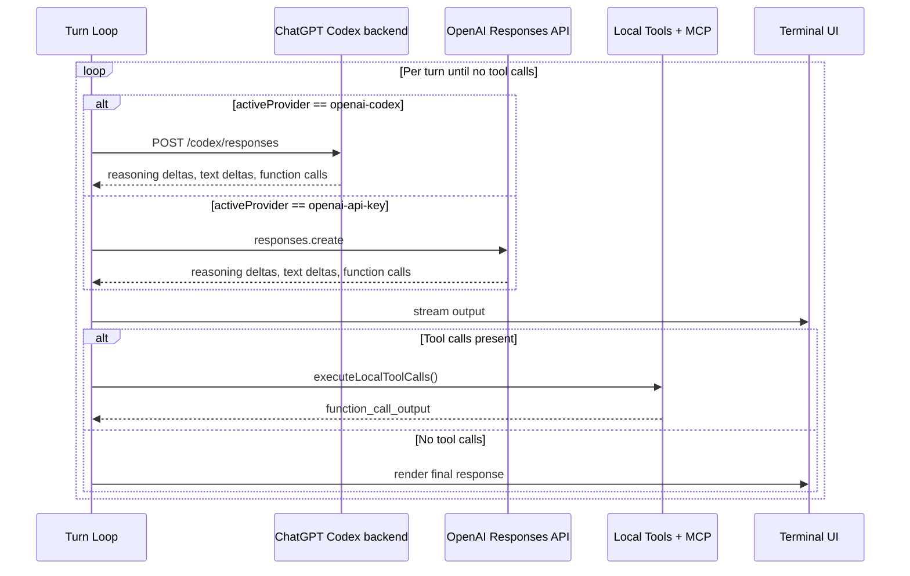
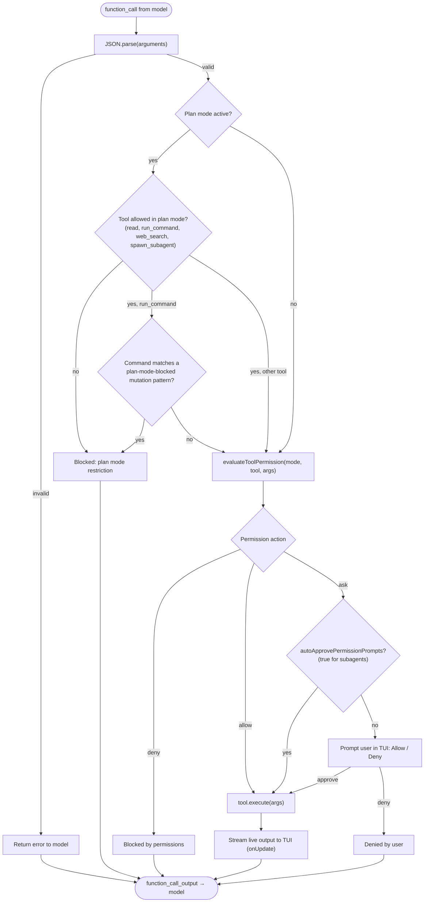
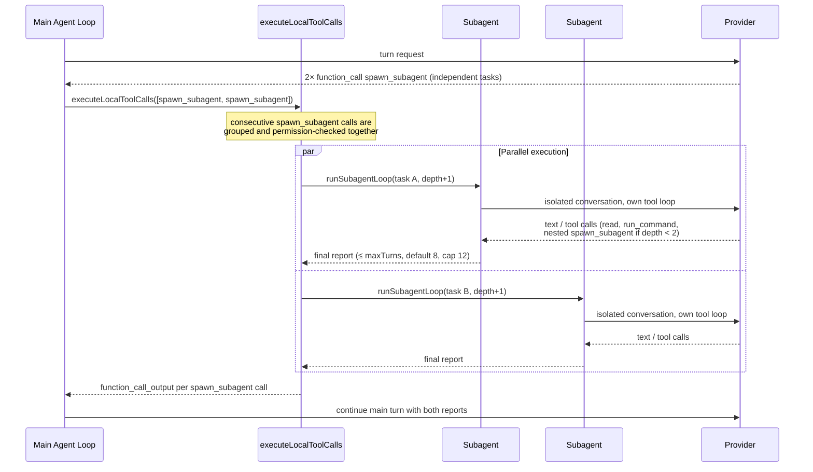

# Perry

[Perry](https://github.com/raunak42/perry) is a terminal-native coding agent with tools, planning, MCP, skills, permissions, and subagents. It ships as the npm package `@perry-ai/cli` and installs a `perry` binary.


## Why I built it?

I built Perry because I wanted a fast, terminal-first coding assistant that feels native to my workflow. The goal is to keep the core loop practical: inspect files, edit code, run commands, reason through plans, use external context when needed, and preserve enough session state to continue real engineering work without turning the terminal into a heavy app.

## Tech stack

- TypeScript
- Bun
- Node.js
- OpenAI Responses API
- ChatGPT/Codex OAuth backend
- Commander
- Express
- MCP over stdio
- JSONL session persistence
- npm

## Some diagrams

### High-Level System Architecture



### Core Agent Turn / Tool-Calling Loop



### Tool Execution & Permission Pipeline



### Subagent Orchestration



## Contributing

1. Fork the repo.
2. Clone the forked repo.
3.
```sh
cd perry
bun install
```
4.
```sh
bun run dev
```
5. In another terminal, run checks before opening a PR:
```sh
bun x tsc --noEmit
bun test
```

The development CLI is now running! Make your code contributions and open some PRs!!!
